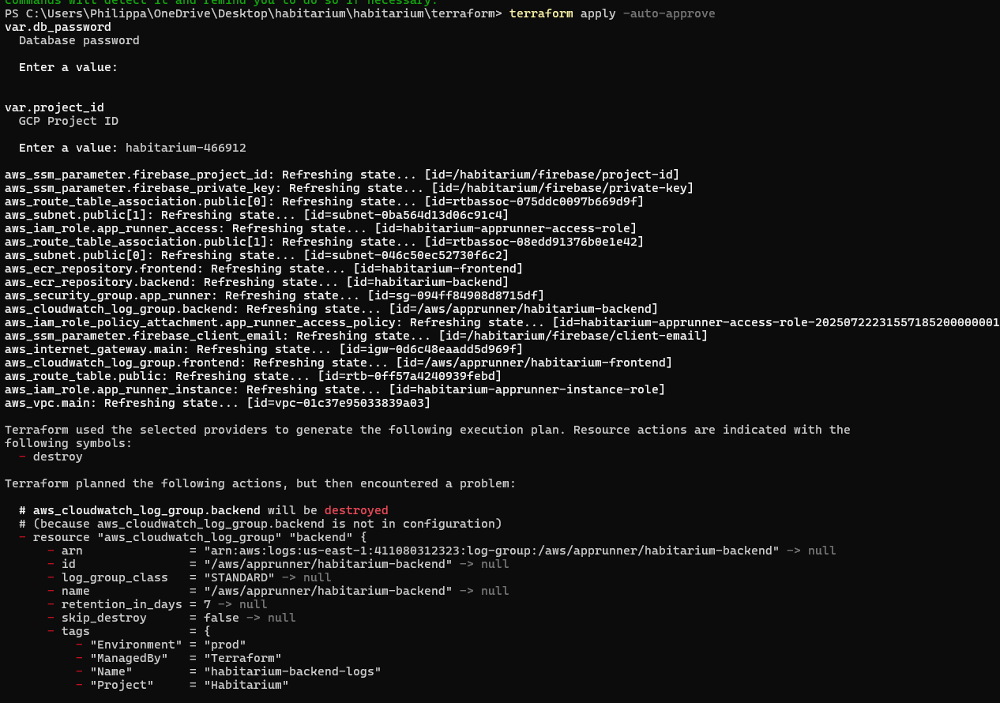
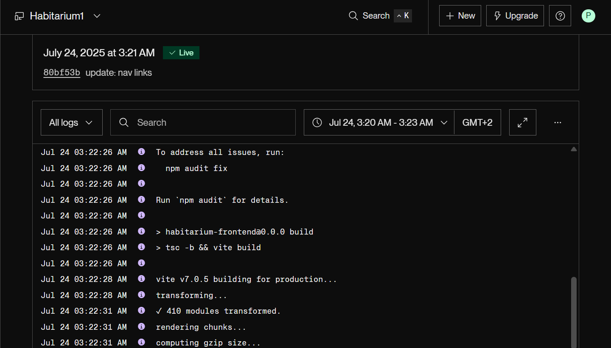
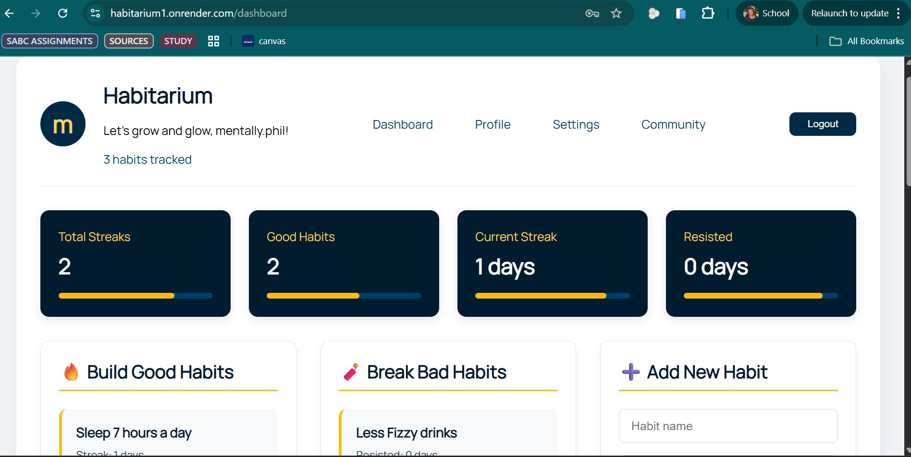
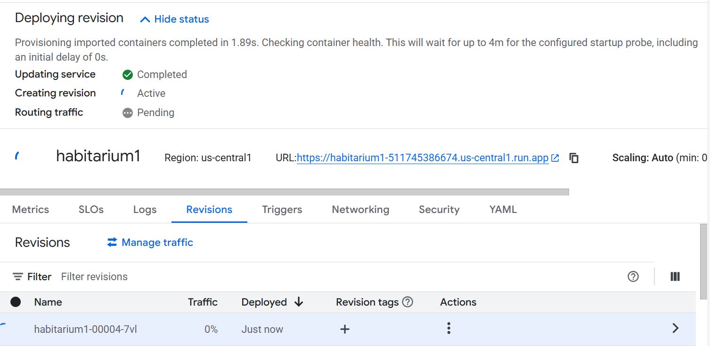
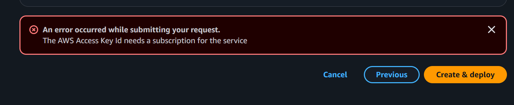

# Phase 2: IaC, Containerization & Manual Deployment

## 🌐Live Public URL
**Application URL**: [https://habitarium-webapp.azurewebsites.net/](https://habitarium-webapp.azurewebsites.net/)  
*Note: Application is fully functional with database connectivity and user authentication*

## 📸Screenshots of Provisioned Resources
1. 
*Displays Google Cloud resources as defined and managed by the Terraform configuration.*
   
3. 
*Confirms manual deployment configuration on Render*

4. 
*Demonstrates working application with database interactions*

5.  
*Visualizes the Terraform-provisioned infrastructure*

## 👥Peer Review
- **Pull Request Reviewed**: [https://github.com/vuwase/bookhub/pull/12(https://github.com/vuwase/bookhub/pull/12)]
- **Feedback Provided**:  
1. Dockerfile Efficiency: Consider leveraging a multi-stage build in your Dockerfile. This can significantly reduce the final image size by separating build-time dependencies from runtime necessities. For instance, you could use one stage to build your Node.js/React application and a leaner base image in a second stage for the final runtime, copying only the necessary artifacts. This improves deployment speed and reduces attack surface.
2. App Runner Configuration: For increased reliability, look into adding health checks within your App Runner service definition. 

## 🧠Reflection on Challenges

### Infrastructure as Code Challenges
1. **Cloud Provider Access Issues**  
   - AWS: Encountered persistent `SubscriptionRequiredException` for App Runner. (Submitter a support ticket for help and was told they'd get back to me soon)
   - Azure: Service principal authentication failures during Terraform apply
   - GCP: Container startup timeouts despite Firebase configuration fixes

2. **Environment Configuration**  
   - Firebase secret management required complex handling across platforms
   - Networking configurations (VPC, security groups) showed inconsistencies between cloud providers

3. **Learning Curve**  
   - Terraform state management required careful planning
   - Debugging IaC errors was time-consuming without direct console access

### Manual Deployment Challenges
1. **Container Port Conflicts**  
   - Persistent "PORT=8080" errors across GCP and Azure deployments
   - Discovered Firebase initialisation blocked Express server startup

2. **Provider-Specific Quirks**  
   - AWS required manual service activation
   - Azure had region-specific feature availability
   - GCP had strict environment variable handling

3. **Debugging Complexity**  
   - Cloud-specific logging tools (CloudWatch, Azure Monitor, Cloud Logging) had different interfaces

### 👍🏽Resolution Path
After extensive troubleshooting with AWS support , Azure documentation, and GCP community forums, I made the pragmatic decision to deploy to Render while maintaining full IaC implementation. This allowed me to:

1. Complete all required IaC components in Terraform
2. Validate containerization through successful Render deployment
3. Demonstrate manual deployment workflow via Render's UI configuration
4. Maintain database connectivity and full application functionality

### 📝Key Learnings
1. **Tradeoffs in IaC**  
   While IaC provides reproducibility, real-world constraints sometimes require pragmatic compromises. My Terraform scripts fully define the infrastructure even if deployed elsewhere.

2. **Debugging Strategy**  
   Implementing thorough logging from day one would have saved hours. The health check endpoint (`/api/health`) proved invaluable.

3. **Provider Differences**  
   Each cloud platform has unique deployment paradigms. GCP's container expectations differ significantly from AWS's.

4. **Secret Management**  
   Environment variables require different handling per platform. Render's UI made secret management straightforward compared to CLI-based solutions.
