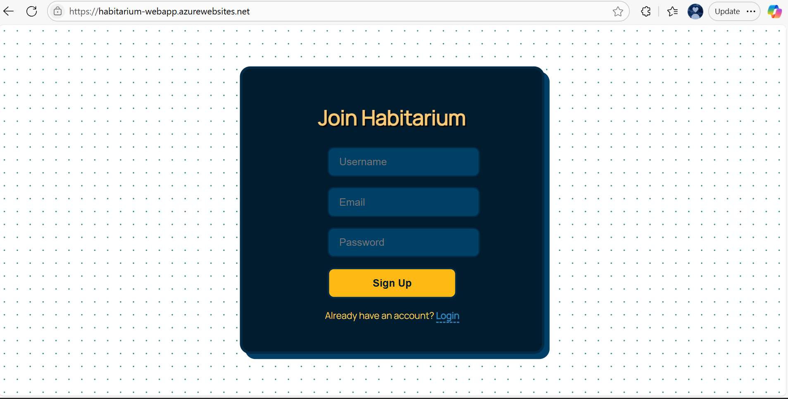
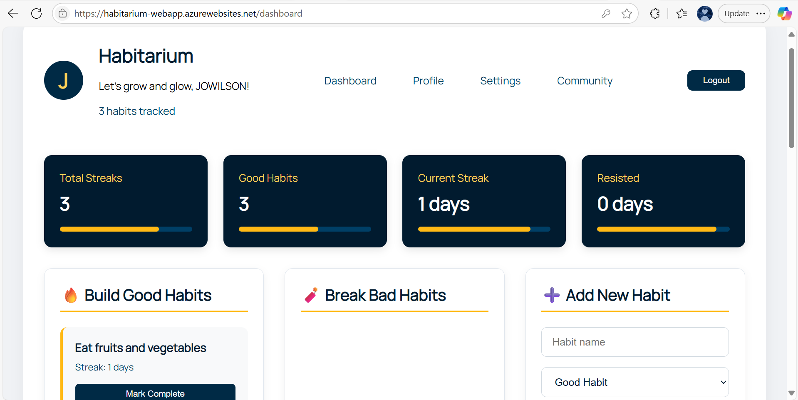
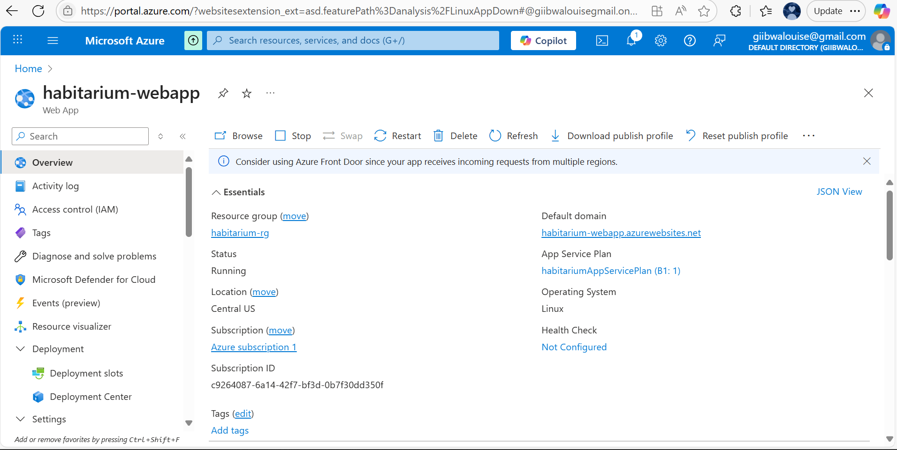
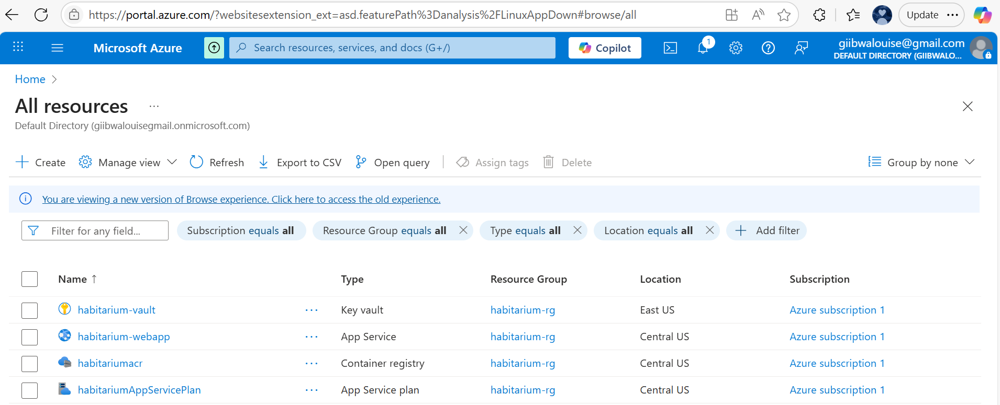

# Phase 2: IaC, Containerization & Cloud Deployment

## 🌐 Live Public URL
**Application URL:** https://habitarium-webapp.azurewebsites.net/  
**Status:** Fully functional with Firebase database connectivity and user authentication

## 📸 Key Implementation Evidence

### 1. Azure Web App Deployment
 
 
*Azure Web App showing successful Docker container deployment and operational status*

### 2. Overview 
 

### 3. Resoruces
 
*Phases (and challenges) gone through during the manual deployment phase*

## 👥 Peer Review
**Pull Request Reviewed:** [https://github.com/vuwase/bookhub/pull/12](https://github.com/vuwase/bookhub/pull/12)  

**Feedback Provided:**  
- **Dockerfile Efficiency:** Recommended implementing multi-stage builds to reduce final image size by separating build-time dependencies from runtime environment  
- **Health Checks:** Suggested adding endpoint monitoring for improved reliability in App Runner service definitions  

## 🧠 Reflection on Challenges & Solutions

### Infrastructure as Code Challenges
| Challenge | Resolution |
|-----------|------------|
| **AWS SubscriptionRequiredException** | Submitted support ticket with AWS while pursuing Azure deployment |
| **Azure Service Principal Authentication** | Configured managed identity and service principal credentials |
| **Cross-Platform Secret Management** | Implemented environment variable transformations with `\n` handling |

### Container Deployment Challenges
| Challenge | Resolution |
|-----------|------------|
| **Port 8080 Conflicts** | Standardised port binding across Dockerfile, app code, and cloud configuration |
| **Firebase Initialization Blocking** | Added health check endpoints and async initialization |
| **Azure Region Limitations** | Selected supported regions for container deployments |
| **Environment Variable Handling** | Created cloud-specific formatting scripts |

## 👍 Resolution Path
After extensive troubleshooting across platforms:
1. Successfully deployed to **Azure Web Apps** with Docker containers
2. Implemented comprehensive health monitoring at `/api/health`
3. Standardised secret management using environment variables
4. Achieved full functionality with Firebase database connectivity

## 📝 Key Learnings
1. **IaC Tradeoffs**  
   While Terraform provides reproducibility, real-world deployment requires cloud-specific adaptations and fallback strategies

2. **Debugging Strategy**  
   Implementing `/api/health` endpoint proved invaluable. Logging should include:
   - Environment validation on startup
   - Route initialization status
   - Dependency connection checks
